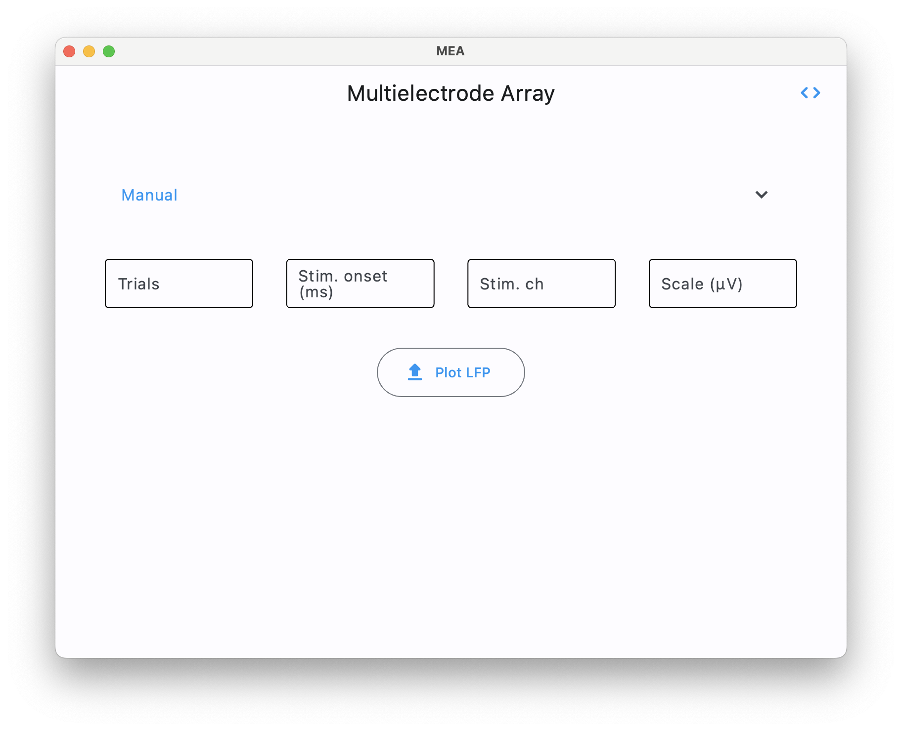
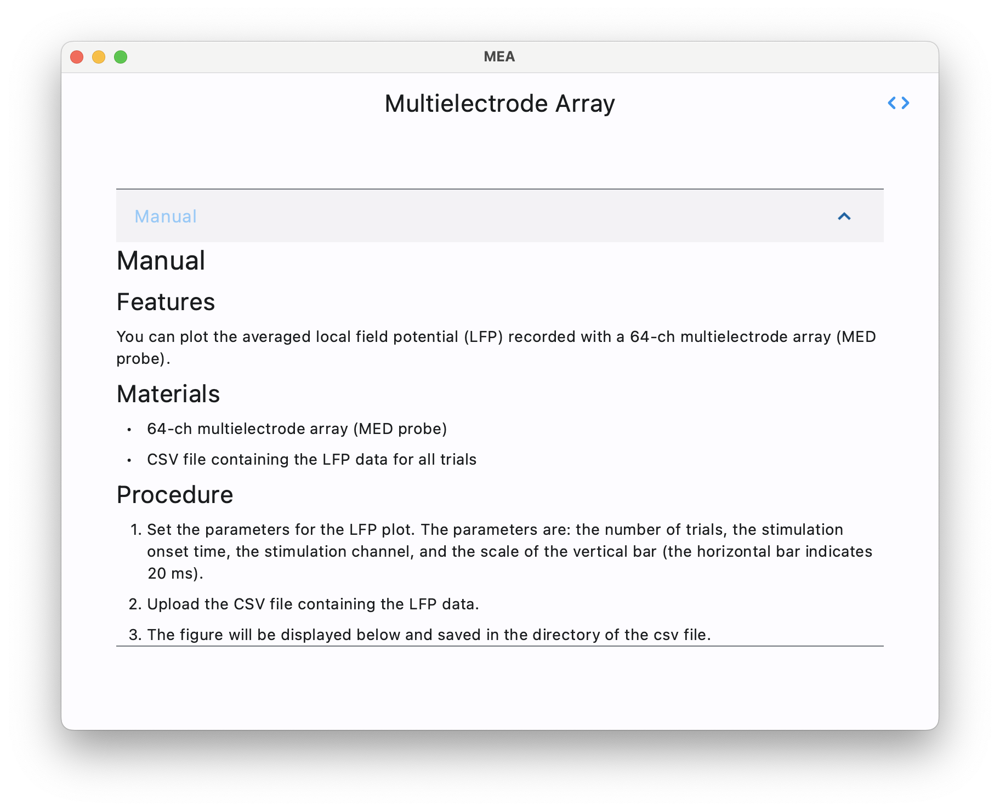
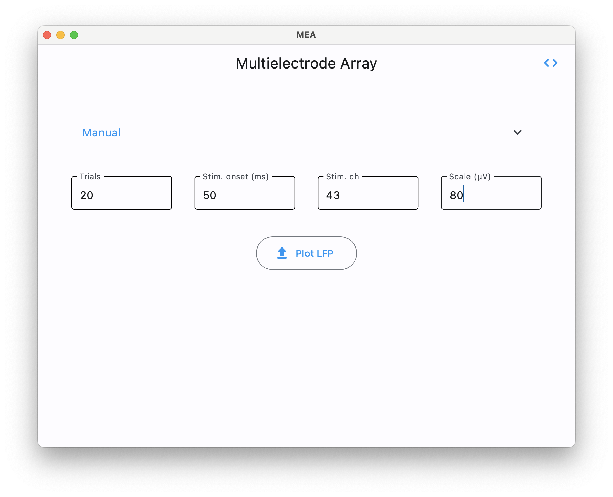
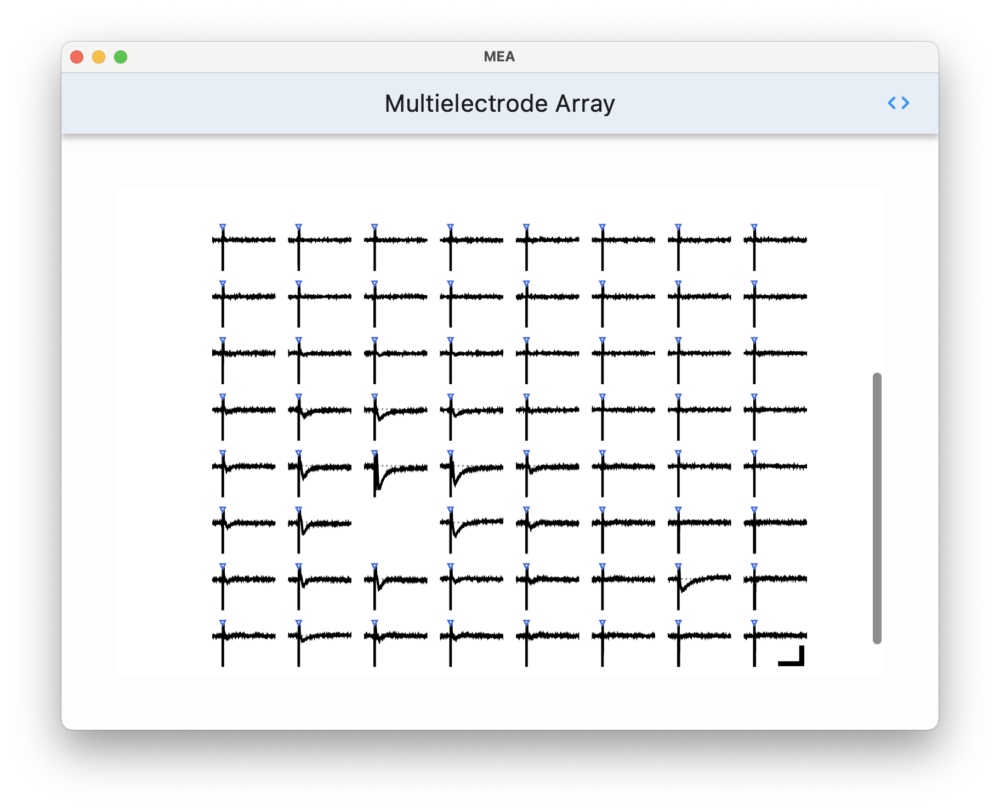

<h1 align=center>
    
     
    MEA-Desktop
</h1>

# Features
You can plot the averaged local field potential (LFP) recorded with a 64-ch multielectrode array (MED probe).

# Install
## Windows
- Download the installer.zip.
- In your computer's Downloads folder, double-click the installer.zip file.
- After the file has been unzipped, double-click the MEA Desktop exe file in the windows folder. 
- MEA Desktop will launch. 
## Mac
- Download the installer.zip.
- In your computer's Downloads folder, double-click the installer.zip file.
- After the file has been unzipped, double-click the MEA Desktop application file in the macos folder. 
- MEA Desktop will launch. 

# Materials
- 64-ch multielectrode array (MED probe)
- CSV file containing the LFP data for all trials

# Instruction
1. Set the parameters for the LFP plot. The parameters are: the number of trials, the stimulation onset time, the stimulation channel, and the scale of the vertical bar (the horizontal bar indicates 20 ms).
2. Upload the CSV file containing the LFP data.
3. The figure will be displayed below and saved in the directory of the csv file.

    
    
    
    

